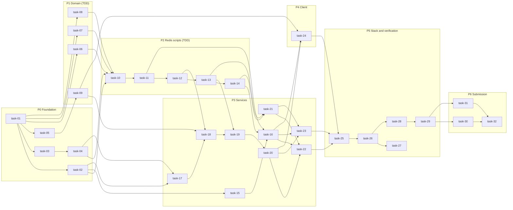

# Tasks

Status: **ready to start** · Last updated: 2026-09-29

The implementation plan, derived from the [TRD](trd.md). There is one file per task in [`tasks/`](tasks/), grouped by phase. Each file has the TRD sections and requirement IDs it implements, its dependencies, the tests to write first, granular steps, done criteria, and sections for notes, verification, and AI collaboration.

## How to work a task

1. Pick the next task whose dependencies are done, and set its status to `in progress` (in its file and on the board below).
2. **TDD tasks:**
   - write the tests listed under "Tests first" in the task file;
   - **I review them before any implementation is written or generated** (D14);
   - implement until they pass under `-race`.
3. Work through the steps, ticking them as you go. Fill in "Notes and decisions" and "Verification". Tick "Done when" (always including `make check` green).
4. Fill in the task's "AI collaboration" section. Significant entries also go to `docs/ai-collaboration/log.md`, with one-line `// AI-assisted: AI-NNN` pointers in the code (D7).
5. Commit with a plain message (no AI trailers). Update the status column below.

**Size:** S ≈ a few hours · M ≈ a day · L ≈ 2–3 days.

## Phases and dependencies

**Critical path:** foundation → domain → scripts → gateway and worker → stack → test kit → simulator → load results. The client (task-24) and the API (task-15, task-16) can run in parallel with the gateway track.

## Board

| Task | Title | Phase | Size | TDD | Status |
|---|---|---|---|---|---|
| [task-01](tasks/p0-foundation/task-01-repository-scaffold.md) | Repository scaffold | P0 | S | — | done |
| [task-02](tasks/p0-foundation/task-02-platform-packages.md) | Platform packages | P0 | M | partial | done |
| [task-03](tasks/p0-foundation/task-03-data-stores-in-docker-compose.md) | Data stores in Docker Compose | P0 | S | — | done |
| [task-04](tasks/p0-foundation/task-04-migrations-and-seed-data.md) | Migrations and seed data | P0 | S | test | done |
| [task-05](tasks/p0-foundation/task-05-code-generation-and-contract-checks.md) | Code generation and contract checks | P0 | M | test | done |
| [task-06](tasks/p1-domain/task-06-identifiers-quiz-codes-validation.md) | Identifiers, quiz codes, validation | P1 | S | yes | done |
| [task-07](tasks/p1-domain/task-07-scoring-and-ranks.md) | Scoring and ranks | P1 | S | yes | done |
| [task-08](tasks/p1-domain/task-08-quiz-state-machine.md) | Quiz state machine | P1 | M | yes | done |
| [task-09](tasks/p1-domain/task-09-protocol-package.md) | Protocol package | P1 | M | yes | done |
| [task-10](tasks/p2-redis-scripts/task-10-integration-test-harness.md) | Integration test harness | P2 | S | — | done |
| [task-11](tasks/p2-redis-scripts/task-11-scripts-create-room-start-join.md) | Scripts: `create_room`, `start`, `join` | P2 | M | yes | done |
| [task-12](tasks/p2-redis-scripts/task-12-script-answer.md) | Script: `answer` | P2 | L | yes | done |
| [task-13](tasks/p2-redis-scripts/task-13-scripts-transition-leaderboard.md) | Scripts: `transition`, `leaderboard` | P2 | L | yes | done |
| [task-14](tasks/p2-redis-scripts/task-14-flush-scripts-and-postgresql-repositories.md) | Flush scripts and PostgreSQL repositories | P2 | M | yes | done |
| [task-15](tasks/p3-services/task-15-auth.md) | Auth | P3 | S | yes | done |
| [task-16](tasks/p3-services/task-16-rest-api-service.md) | REST API service | P3 | M | yes | done |
| [task-17](tasks/p3-services/task-17-question-cache.md) | Question cache | P3 | M | yes | done |
| [task-18](tasks/p3-services/task-18-gateway-connections.md) | Gateway: connections | P3 | L | yes | done |
| [task-19](tasks/p3-services/task-19-gateway-registry-and-room-events.md) | Gateway: registry and room events | P3 | L | yes | todo |
| [task-20](tasks/p3-services/task-20-gateway-message-handlers-and-presence.md) | Gateway: message handlers and presence | P3 | M | yes | todo |
| [task-21](tasks/p3-services/task-21-worker.md) | Worker | P3 | L | yes | todo |
| [task-22](tasks/p3-services/task-22-shutdown-and-degraded-modes.md) | Shutdown and degraded modes | P3 | M | yes | todo |
| [task-23](tasks/p3-services/task-23-observability.md) | Observability | P3 | M | partial | todo |
| [task-24](tasks/p4-client/task-24-react-client.md) | React client | P4 | L | partial | todo |
| [task-25](tasks/p5-stack-and-verification/task-25-full-local-stack.md) | Full local stack | P5 | M | — | todo |
| [task-26](tasks/p5-stack-and-verification/task-26-test-kit.md) | Test kit | P5 | M | yes | todo |
| [task-27](tasks/p5-stack-and-verification/task-27-end-to-end-and-fault-tests.md) | End-to-end and fault tests | P5 | L | — | todo |
| [task-28](tasks/p5-stack-and-verification/task-28-simulator-and-k6.md) | Simulator and k6 | P5 | M | partial | todo |
| [task-29](tasks/p5-stack-and-verification/task-29-load-runs-and-results.md) | Load runs and results | P5 | M | — | todo |
| [task-30](tasks/p6-submission/task-30-root-readme-and-run-instructions.md) | Root README and run instructions | P6 | S | — | todo |
| [task-31](tasks/p6-submission/task-31-ai-collaboration-docs.md) | AI collaboration docs | P6 | S | — | todo |
| [task-32](tasks/p6-submission/task-32-submission-review.md) | Submission review | P6 | S | — | todo |

The video is prepared outside this repo (`internal/video-script.md`) once task-29 is done.

## Folders

- [`tasks/p0-foundation/`](tasks/p0-foundation/): P0 Foundation
- [`tasks/p1-domain/`](tasks/p1-domain/): P1 Domain (TDD)
- [`tasks/p2-redis-scripts/`](tasks/p2-redis-scripts/): P2 Redis scripts (TDD)
- [`tasks/p3-services/`](tasks/p3-services/): P3 Services
- [`tasks/p4-client/`](tasks/p4-client/): P4 Client
- [`tasks/p5-stack-and-verification/`](tasks/p5-stack-and-verification/): P5 Stack and verification
- [`tasks/p6-submission/`](tasks/p6-submission/): P6 Submission
