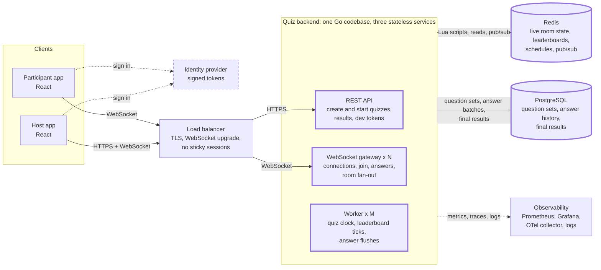
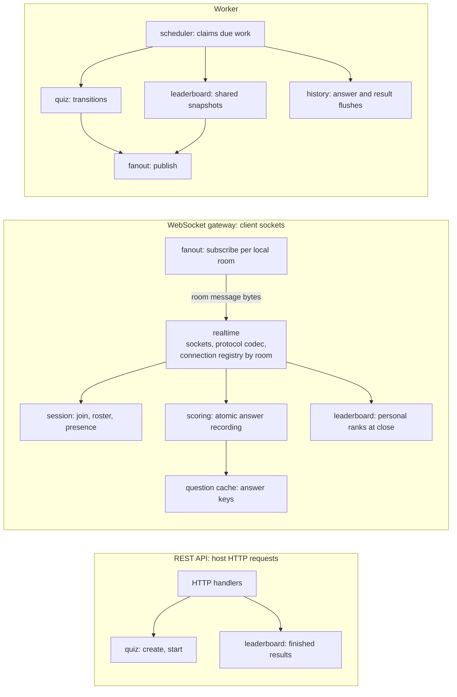

# Architecture

This covers the whole real-time quiz feature: the part we build (the Go quiz backend) and the parts we mock. Requirement IDs (FR-n, NFR-n) refer to [`../planning/requirements.md`](../planning/requirements.md).

## 1. System overview

**Legend:** thick border = built or run for real in this challenge · dashed border = mocked behind an interface · plain = thin demo or standard infrastructure.

**The design in brief:**

- **Three services, one codebase (D11).**
  - The **REST API** handles request/response actions: create a quiz, start it, read results.
  - The **WebSocket gateway** holds live connections and handles joins and answers.
  - The **worker** runs everything time-based: the quiz clock, leaderboard ticks, and answer flushes.
  - They share the same internal modules and scale independently: gateways by connection count, workers by the number of active rooms.
- **All three are stateless.** Every piece of live quiz state is in Redis. Any gateway can serve any participant of any quiz, so the load balancer needs no sticky sessions (D10, NFR-24, NFR-25).
- **Rooms are virtual.** A quiz room is a set of Redis keys plus one pub/sub channel. It isn't tied to any process.
- **No process owns a quiz.** Every worker runs the same loop. Transitions are Lua scripts with a version check, so exactly one worker applies each one (NFR-14).
- **One clock.** Deadlines and answer receive times come from Redis `TIME` inside the scripts, so there is no clock skew between services.
- **Broadcast once.** A room update is one pub/sub message, encoded once by the worker that produces it. Every gateway writes those same bytes to its local sockets for that room (NFR-5b, NFR-5c).
- **Redis keeps only what is live or not yet saved.** Each question's answers are batch-written to PostgreSQL after it closes and removed from Redis once the write is confirmed (FR-33, FR-34).

## 2. Services and modules

Each service is a thin entry point (`cmd/api`, `cmd/ws`, `cmd/worker`) that wires together the modules it needs from `internal/` (D9). Arrows show call direction.

The three services **never call each other**. Each one talks only to Redis and PostgreSQL (see the system diagram in §1). Room messages travel from a worker to the gateways through Redis pub/sub, not through a direct connection.

| Service | Does | Doesn't |
|---|---|---|
| **REST API** | Create a quiz, start it (host only), return a finished quiz's results, issue dev tokens, health and metrics | Hold connections or run timers |
| **WebSocket gateway** | Accept and track sockets, join, record answers and reply to the submitter immediately, keep presence alive, deliver room messages to local sockets, send personal ranks at question close | Decide when a question opens or closes; produce shared leaderboard updates |
| **Worker** | Apply due transitions, produce shared leaderboard snapshots, flush answers and final results, reconcile totals at finish | Hold client connections |

- **Why answers go through the gateway and not the worker:** the submitter needs an immediate result (FR-20). The gateway runs the answer script directly and replies on the same socket, with no extra hop.
- **Why start goes through the REST API:** starting is a one-off host command with a clear request/response shape. The host still opens a WebSocket to watch the room live.
- **Why every service can run on its own:** each depends only on Redis and PostgreSQL, never on another service. A worker outage stops quiz progress but not connections. A gateway outage drops only its own sockets.

## 3. Components

### Participant and host apps (React, thin demo)

| | |
|---|---|
| Role | Participant: join with quiz code and name, answer, watch the live leaderboard. Host: create a quiz, share the code, press Start, watch |
| State | View state only. Keeps the last leaderboard `version` and ignores anything older (FR-28) |
| Failure | Reconnects with exponential backoff and jitter, then rebuilds its view from the snapshot the gateway sends on join (FR-29) |

### Identity provider (mocked)

| | |
|---|---|
| Role | Issues short-lived signed tokens carrying the user ID and role (`participant` or `host`). The display name is chosen at join (FR-8). The WebSocket sends the token in the query string (D15) |
| Built as | A dev-only token endpoint on the REST API that signs with a shared secret. In production, ELSA's existing identity service, with tokens verified against its public keys |
| Why it matters | Clients can't choose their own user ID or claim the host role (NFR-19) |

### Load balancer

| | |
|---|---|
| Role | TLS termination; routes `/api/*` to REST API instances and `/ws` to gateways |
| State | None. **No sticky sessions**, because any gateway can serve any quiz |
| Scaling | Managed L4/L7 balancer in production; nginx in the local stack |
| Failure | Health checks remove instances whose readiness fails (NFR-29) |

### REST API (Go, built)

| | |
|---|---|
| Role | Quiz creation: validate the question set exists, create the room record in `lobby`, schedule lobby expiry. Start: host-only, runs the `lobby → question_open` transition. Finished quiz results read from PostgreSQL (FR-13). Dev token endpoint |
| State | None |
| Scaling | Horizontal; low traffic compared to the gateways |
| Failure | Stateless; any instance can serve any request |

### WebSocket gateway (Go, built): the real-time edge

| | |
|---|---|
| Role | Upgrades and holds participant and host sockets; validates, rate-limits, and dispatches messages; join; answer recording; presence heartbeats; delivers room messages to local sockets; personal ranks at question close |
| State | Local sockets, the **connection registry** (room → local connections), room subscriptions, and the **question cache**. None of it is quiz state; all of it can be rebuilt |
| Scaling | Horizontal by connection count (target 20,000 per instance, NFR-3). A room's participants can be spread over any number of gateways |
| Failure | Its clients reconnect to other gateways and get a fresh snapshot. Its presence entries expire after 30 s. The room is unaffected |

### Worker (Go, built): the quiz clock and background jobs

| | |
|---|---|
| Role | One scheduler loop per instance that claims due work from Redis: transitions every 100 ms, leaderboard ticks every 200 ms, pending flush jobs. Publishes room messages. Writes answer history and final results; reconciles totals at finish (FR-35) |
| State | None. All work is claimed from Redis, so any worker can do any job |
| Scaling | Horizontal. At least 2 instances for availability; more if the number of active rooms grows. Claims are atomic, so adding workers never duplicates work |
| Failure | Another worker picks up the same due work on its next poll. Flush jobs held by a dead worker become due again after 30 s. **If every worker is down, quizzes stop advancing**, so "no healthy workers" is a paging alert |

### Redis: live state, schedules, fan-out

| | |
|---|---|
| Role | Source of truth for everything live: room control record, roster, presence, leaderboard, the current question's answers, the schedules, and room pub/sub channels |
| Why Redis | Atomic Lua scripts give exactly-once scoring and transitions. Sorted sets give O(log N) leaderboard updates. Pub/sub gives cross-instance fan-out on the same infrastructure. Sub-millisecond latency |
| Scaling | One primary with a replica. The expected ceiling, and the Redis Cluster step beyond it, are in `non-functional.md` |
| Failure | Failover to the replica (Sentinel or managed service). While Redis is unreachable, answers are rejected with a retryable error, never falsely acknowledged, and services report not-ready (NFR-15) |

### PostgreSQL: persistent storage

| | |
|---|---|
| Role | Question sets with answer keys (read-only here), answer history (FR-32), final results (FR-27a) |
| Built as | **Real PostgreSQL in Docker Compose (D12)**, with SQL migrations and several seeded question sets. Accessed through repository interfaces; unit tests use gomock mocks of those interfaces, integration tests use a real PostgreSQL container (D14) |
| Scaling | Off the hot path: one batch per question per room, after the answer burst |
| Failure | Flushes are retried. Redis keeps unflushed data, with its TTL extended, until the write is confirmed (NFR-13a, NFR-18) |

### Observability stack

| | |
|---|---|
| Role | Prometheus scrapes `/metrics` on every service; Grafana dashboards; OpenTelemetry traces for the answer and broadcast paths; structured JSON logs |
| Built as | `/metrics`, structured logs, and health endpoints are built. Dashboards and the collector are part of the local stack if time allows |

## 4. Concurrency and shared state

Every service instance handles many quizzes at once, and many instances touch the same quiz. The rules that keep this safe:

**Shared state lives only in Redis, and every change is one atomic script.**
- Redis executes commands and Lua scripts one at a time, so a script sees and changes state with nothing interleaved. No distributed locks are needed.
- **No read-modify-write in Go code.** A service never reads a value, changes it in memory, and writes it back. That pattern would need a lock. Every change is a single script: join, answer, transition, leaderboard snapshot, flush claim.
- **Reads that must be consistent are scripts too.** The leaderboard snapshot reads the top 10, the participant count, and increments the version in one script, so a snapshot never mixes two moments.
- **Hot key.** Every answer in a room updates the same leaderboard key. Redis serialises those updates, which makes them correct by construction. The cost is that one room's answer throughput is bounded by a single Redis thread. The numbers are in `non-functional.md`.

**Per-process state is partitioned by room and never shared between rooms.**
- **Connection registry** (gateway): a map of room → set of local connections, split into shards by room ID, each with its own read/write lock. Joins and leaves lock only one shard. A broadcast copies the room's connection list under a read lock, releases the lock, then enqueues to each connection. No lock is held while writing to sockets.
- **Per-connection write queue:** each socket has one bounded outbound queue and one writer goroutine. Only that goroutine writes to the socket. A full queue triggers the slow-client policy (NFR-17) instead of blocking the broadcast.
- **Question cache** (gateway, and the worker for question content): keyed by **question-set ID**, not quiz ID. Two quizzes using the same set share one entry.
  - Entries are immutable once loaded, so reads need no lock beyond the map lookup.
  - Loads are de-duplicated (single-flight), so 1,000 joins arriving at once for a new quiz cause one database read.
  - The cache is warmed when the first local participant joins a room, so validating an answer never needs an external read.
  - An entry is dropped when no local room uses it, subject to a memory cap.

## 5. Redis data model

Every key of a room contains the `{quizId}` hash tag, so all of a room's keys land in the same Redis Cluster slot and can be used together in one Lua script. Exact field layouts belong in the TRD.

| Key | Type | Contents | Lifetime |
|---|---|---|---|
| `quiz:{id}:room` | hash | status, question index, opened-at, original deadline, effective close time, next transition time, window and reveal durations, start requested, lobby expiry, state version, leaderboard version, host ID, question set ID | quiz |
| `quiz:{id}:roster` | hash | participant ID → display name | quiz |
| `quiz:{id}:online` | sorted set | participant ID → last-seen time, refreshed by the gateway holding the connection | quiz |
| `quiz:{id}:lb` | sorted set | participant ID → total score | quiz |
| `quiz:{id}:q:{n}:answers` | hash | participant ID → option, correct, points, receive time | until that question's flush is confirmed |
| `sched:transitions` | sorted set | quiz ID → time of its next transition | global |
| `sched:lbdirty` | set | quiz IDs whose leaderboard changed since the last tick | global |
| `sched:flush` | sorted set | pending flush job → time it may next be attempted | global |
| `room:{id}` | pub/sub channel | encoded messages for everyone in the room | — |

Question content and answer keys are **not** in Redis. They never change, so services cache them in memory (§4).

## 6. What is built, thin, or mocked

| Component | This challenge |
|---|---|
| REST API, WebSocket gateway, worker | **Built** at production quality. Locally: 1 API, 2 gateways, 2 workers |
| Redis | **Real**, single instance locally |
| Load balancer | **Real** nginx locally |
| React apps | **Thin** demo |
| Identity provider | **Mocked**: dev token endpoint |
| PostgreSQL | **Real**, in Docker Compose, with migrations and seeded question sets (D12) |
| Observability | `/metrics`, logs, and health endpoints **built**; dashboards optional |
