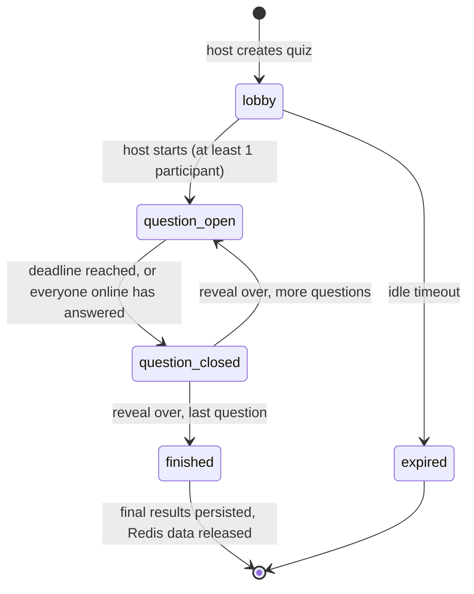
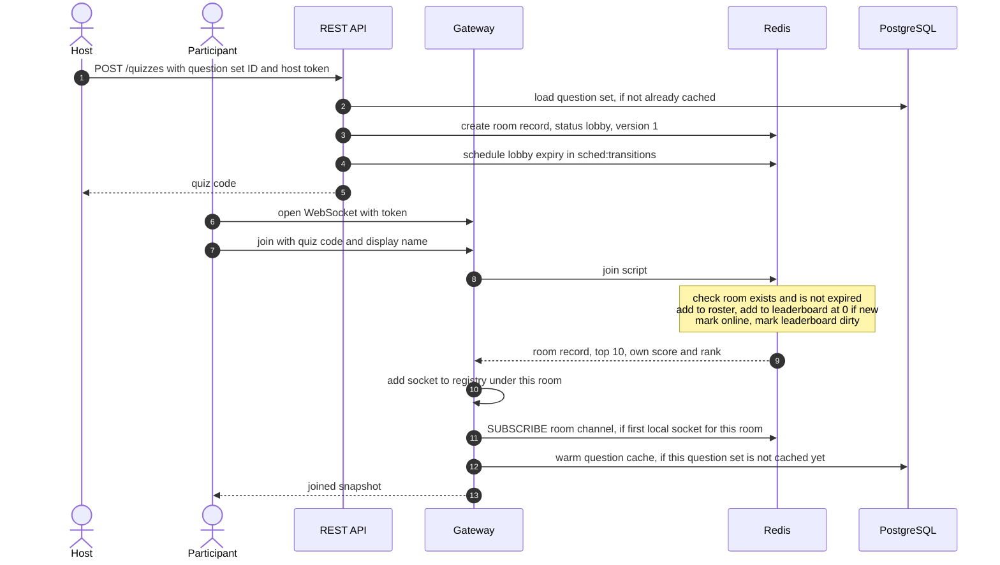
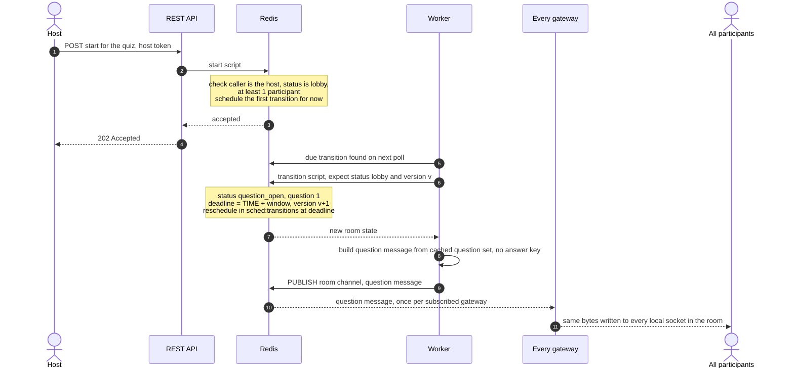
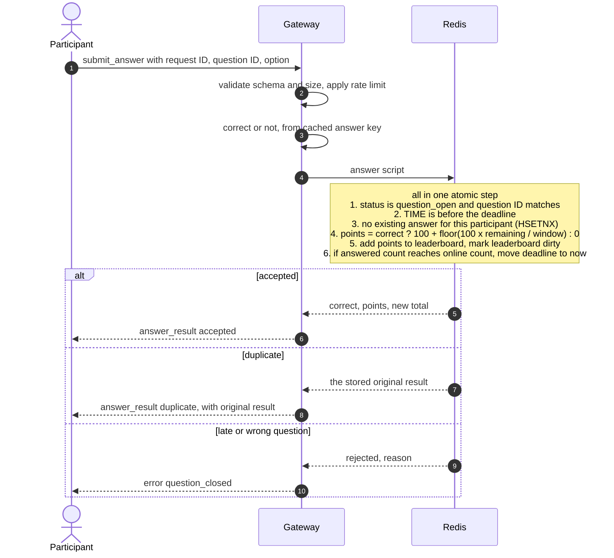
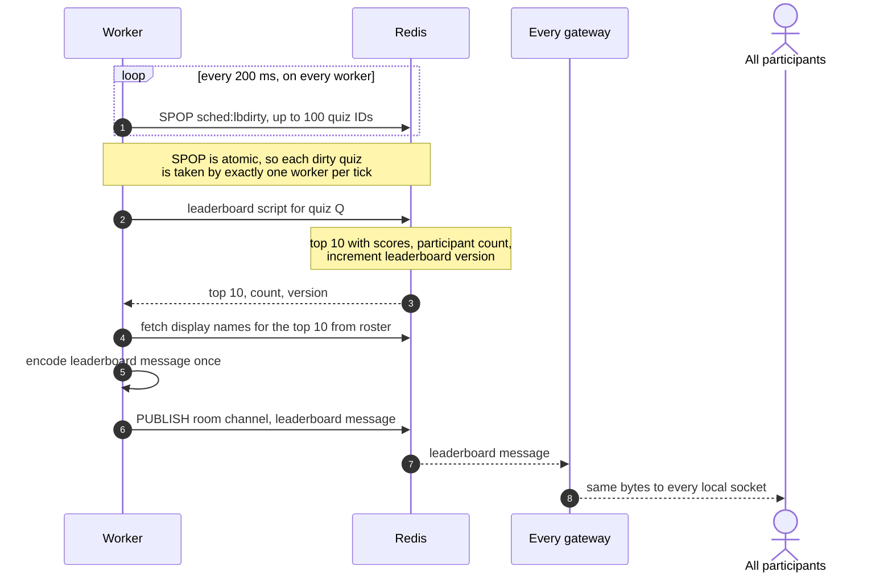
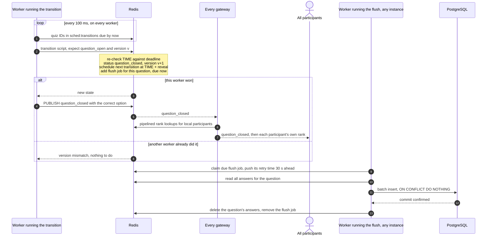
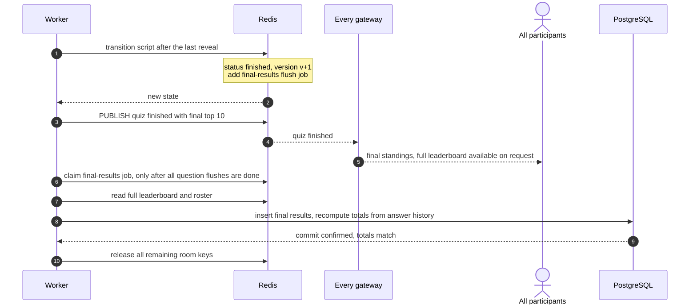
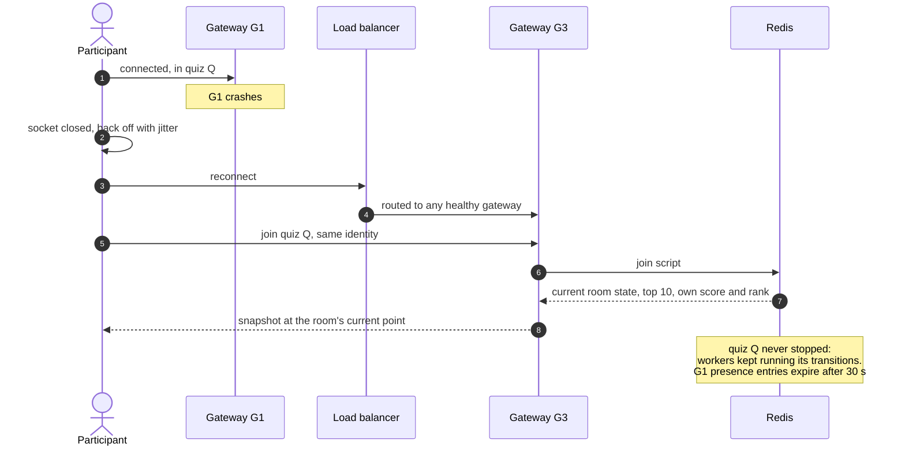

# Data flow

How data moves through the system, from the moment a host creates a quiz to the moment every participant sees the final leaderboard. The components are described in [`architecture.md`](architecture.md). Requirement IDs refer to [`../planning/requirements.md`](../planning/requirements.md).

The diagrams use the three backend services from the architecture: **REST API**, **Gateway** (WebSocket gateway), and **Worker**. Each runs as several instances, and which instance handles a step doesn't matter; that is the point of the design.

## Overview

| # | Flow | Triggered by |
|---|---|---|
| 1 | Create a quiz and join | Host request, participant join |
| 2 | Start and open a question | Host `start`, then the scheduler |
| 3 | Submit an answer | Participant |
| 4 | Leaderboard update | Scheduler tick after score changes |
| 5 | Close a question, reveal, flush answers | Scheduler (deadline or early close) |
| 6 | Finish the quiz | Scheduler after the last reveal |
| 7 | Reconnect and instance failure | Network or instance failure |

## 1. Create a quiz and join

- **FR-8, FR-9:** the join script is atomic, so many simultaneous joins can't lose or duplicate a participant.
- **FR-12:** rejoining with the same identity finds the existing roster and leaderboard entries and keeps the score.
- **FR-11:** the snapshot includes the current question without its answer, and the deadline.
- The question cache is warmed at join, so validating this participant's answers later needs no external read. It's keyed by question set and loaded once per gateway.
- If the same identity is already connected elsewhere, the gateway publishes a control message on the room channel, and the gateway holding the older socket closes it.
- Marking the leaderboard dirty makes the next tick (flow 4) broadcast the new participant count (FR-14).

## 2. Start and open a question

- **FR-3:** only a `host` token can start, only from `lobby`, and only with at least one participant.
- **One transition path:** the API doesn't open the first question itself. It schedules the transition for "now", and a worker applies it like any other. Only workers publish room state, and there is one code path for every transition. The cost is at most one poll interval (100 ms) between pressing Start and the first question.
- **FR-4:** from here on, nobody sends commands. Every later transition comes from the workers (flow 5).
- **NFR-8:** the question reaches every participant through one publish. Fairness depends only on pub/sub and socket-write latency, not on which instance a participant is connected to.
- **FR-21:** the answer key never leaves the server's memory.

## 3. Submit an answer

- **NFR-12, FR-17, FR-18:** duplicate detection, the deadline check, and scoring happen in one script, so concurrent or repeated submissions can't score twice. An answer racing the close has only two outcomes: the script runs before the close transition (accepted) or after it (rejected). Redis runs scripts one at a time, so there is no in-between.
- **No submissions after the close.** The answer script checks Redis `TIME` against the deadline itself; it doesn't rely on the status alone. So even if the workers are late closing the question (poll delay, a worker restart, a Redis failover), an answer received after the deadline is still rejected. The early close only ever moves the deadline *earlier*, never later. The question ID check stops answers to a previous question once the next one opens. An answer sent before the deadline but received after it is rejected, because server receive time is the rule (assumption in the requirements).
- **NFR-13:** the client is acknowledged only after the script has written to Redis. If the reply is lost, resending the same request returns the stored result (FR-30).
- **FR-19:** points use Redis `TIME`, not the client's or the instance's clock.
- **FR-5:** when everyone online has answered, the script moves the deadline to now. The close then happens through the normal transition path (flow 5), so there is only one close code path.
- **FR-20, FR-21:** only the submitter learns whether they were right, straight away. Nothing is broadcast per answer.

## 4. Leaderboard update

- **FR-25, NFR-10:** a burst of 10,000 answers produces at most 5 leaderboard messages per second per room, not 10,000.
- **FR-26, NFR-5c:** the message is identical for everyone, so it's encoded once and written as the same bytes to every socket.
- **FR-28:** clients drop any leaderboard with a version lower than the last one they rendered.
- **NFR-6:** worst-case added delay is one tick (200 ms) plus publish and write time.

## 5. Close a question, reveal, flush answers

- **NFR-14:** several instances may notice the same due quiz. The version check lets exactly one apply the transition; the rest get a version mismatch and do nothing.
- **FR-26:** personal ranks are computed once per question, by each instance for its own sockets, in a pipelined batch.
- **FR-33, FR-34, NFR-13a:**
  - The flush happens after the burst, as one batch per question.
  - Redis data is deleted only after the database confirms the commit.
  - If the flushing instance dies at any point, the job becomes due again 30 s later and another instance retries it. The unique key (quiz, question, participant) makes the retry harmless.
- The next transition, after the reveal, runs the same flow in reverse: `question_closed → question_open` for the next question, published as in flow 2.

## 6. Finish the quiz

- **FR-27, FR-27a:** the final leaderboard is persisted, so after the Redis data is released a finished quiz can still be viewed read-only from the database (FR-13).
- **FR-35:** totals recomputed from stored answers must equal the leaderboard. A mismatch is logged and counted, and would indicate a scoring bug.
- **NFR-18:** the room's Redis keys are released only after the final write is confirmed. The 24 h TTL is only a safety net.

## 7. Reconnect and instance failure

- **FR-29, NFR-17:** the participant resumes where the room is now. Questions that closed while they were away score 0 for them.
- **FR-30:** if G1 crashed after the answer script ran but before the reply was sent, the client resends the answer after reconnecting. While the question is still open it gets the original result back as a duplicate. After the close, the total in the snapshot already includes it.
- **NFR-14:** no quiz belonged to G1, so nothing needs to be taken over. The same holds for a worker crash: the other workers pick up its due work on their next poll.
- Jittered backoff spreads the reconnect burst after an instance dies, so 20,000 clients don't all hit the survivors at the same moment.

## How the flows meet the acceptance criteria

| Brief | Flows |
|---|---|
| Join a quiz by unique ID; many users at once | 1, 7 |
| Scores update in real time, accurately and consistently | 3, 5 |
| Leaderboard of all participants, updated promptly | 4, 5, 6 |
